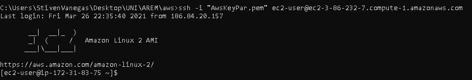
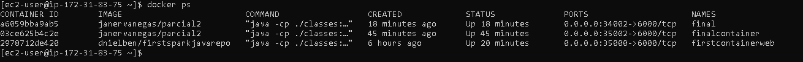
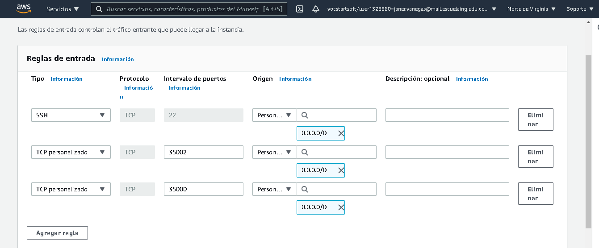
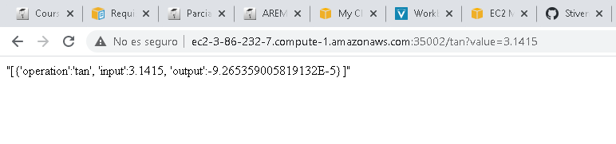

## Taller de Introducción a Heroku

### AUTOR
* Janer Stiven Vanegas Trujillo

### REQUISITOS
* Java
* Maven
* Git

### JAVADOC

Para generar la documentacion java del proyecto ejecute las siguientes instrucciones.

`mvn javadoc:javadoc`

`mvn site`

`mvn site:run`

Y a continuación ir a la siguiente direccion web

`http://localhost:8080/apidocs/index.html`

### IMPLEMENTACION EC5

Para ingresar a la maquina virtual descargamos las llaves que AWS nos proporciona, y continuación mediante ssh nos conectamos a la maquina virtual

Despues se crea una instancia del contenedor docker

Se agrega la regla de entreda con el puerto correspondiente

Finalmente accedemos a la url y comprobamos el funcionamiento, en la siguiente imagen se prueba la funcion 'tan'

